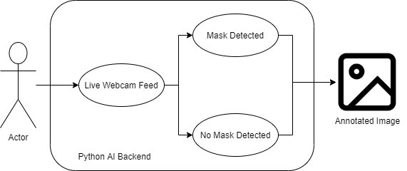
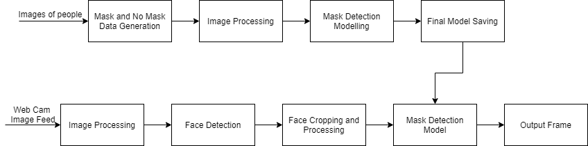
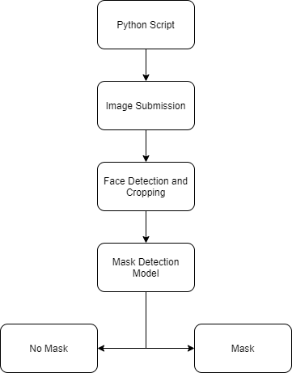
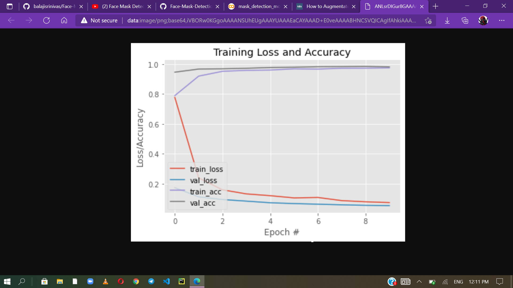
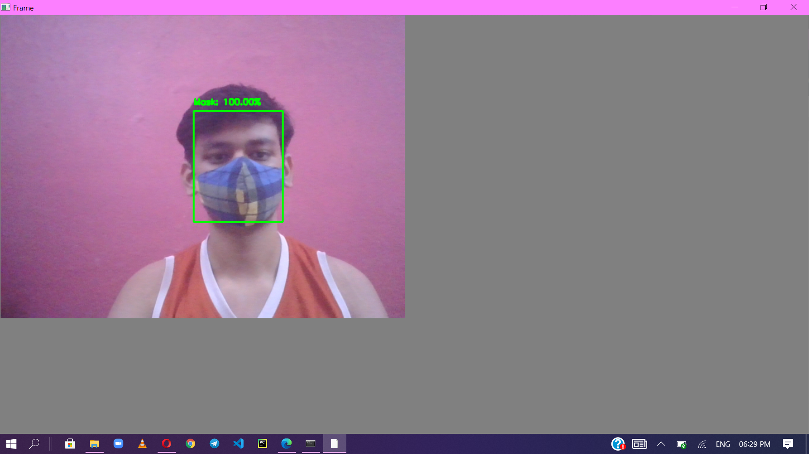

# Mask-Detection

Mask Detection using OpenCV and Deep Learning

## Problem

Wearing a mask in public settings is an effective way to keep the communities safe in this COVID-19 pandemic.We want to build a system that can detect faces in real-world videos and identify if the detected faces are wearing masks or not. So, what do we mean by real-world videos? If you look at the people in videos captured by CCTV cameras, you can see that the faces are small, blurry, and low resolution. People are not looking straight to the camera, and the face angles vary from time to time. These real-world videos are entirely different from the videos captured by webcams or selfie cameras, making the face mask detection problem much more difficult in practice.

## Data Source 

https://www.kaggle.com/omkargurav/face-mask-dataset

# Methodology Used

## Face Mask Detection Use Case:

## Face Mask Detection Architecture:

## Face Mask Detection Module Heirarchy Diagram:

# Model Results:

## Face Mask Detection Model Training Summary:

# Outputs:

## Non real-time:

## Real-time:

## Improvements:

1) UI Interface
2) Deployment
3) Fault Tolerant
4) Scalability

